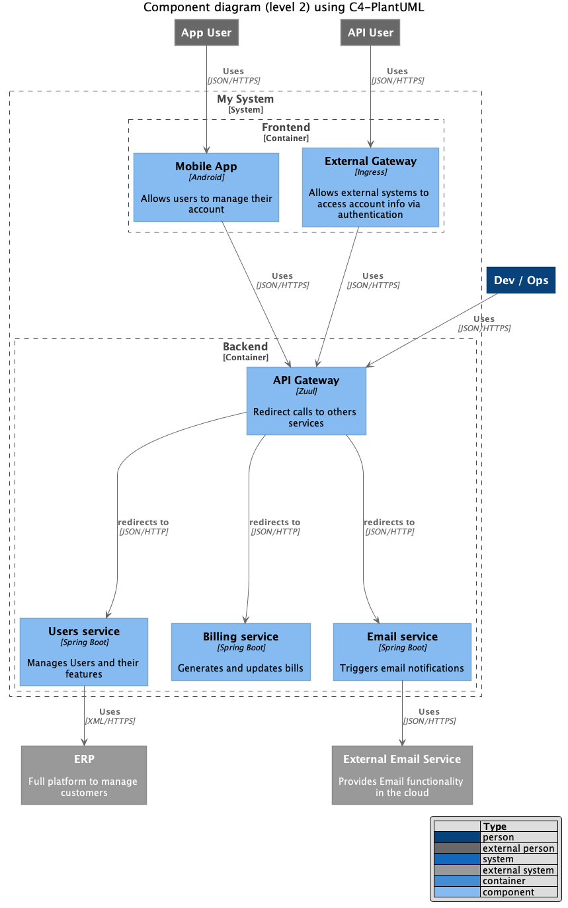

# 4. Architecture Overview

The most important part of this section should be the System Context and the Container diagrams (C1 and C2 respectively in the [C4 model](https://c4model.com/)). 

I recommend you to follow a *Diagrams as Code* approach and use a tool like [PlantUML](http://plantuml.com/) to keep them in the repository. With PlantUML you can generate quickly very simple diagrams, but you can also use some available extensions like [C4-PlantUML](https://github.com/RicardoNiepel/C4-PlantUML) to make them look much nicer. See below for an example.

They should tell most of the story by themselves, but feel free to add some description if you need more details.

If you're starting a project from scratch, avoid including here your *Target Architecture*. This section should reflect the current status of your Architecture, not the ideal situation where you want to be (that will be placed in the *Roadmap* section). Read Chapter 5 to understand how you describe your *Roadmap*.  

